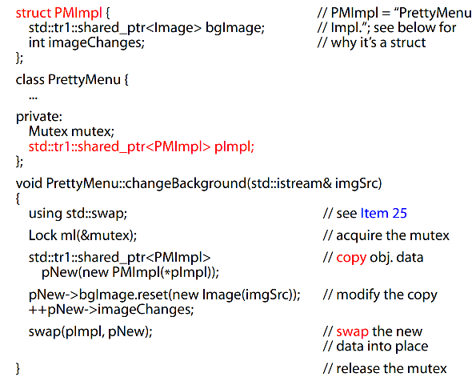

# Item29: Strive for exception-safe code

## Things to Remember1
Exception-safe functions leak no resources and allow no data structures to become corrupted, even when exceptions are thrown. Such
functions offer the basic, strong, or nothrow guarantees.

### what is corrupted data structures?
e.g., sorted arrays might not be sorted any longer, objects being transferred from one data structure to another
might have been lost, etc.

### the basic guarantee
If an exception is thrown, everything in the pragram remains in a valid state. (e.g., No objects or data structures become corrupted.) 

### the strong guarantee
If an exception is thrown, the state of the program is unchanged.

### the nothrow guarantee
It promises never to throw exceptions.

## Things to Remember2
The strong guarantee can often be implemented via copy-and-swap, but the strong guarantee is not practical for all functions.

### Copy-and-Swap
这个很好理解也是一个常用的方法，对想要修改的object进行拷贝，对于拷贝的object做所有的修改，当所有的修改成功后，再以non-throwing的方式执行swap操作。

### Non-throwing Swap
swap在Item25中进行了详细的描述，为什么要有专门一个item讲swap？因为swap最有用的一个应用就是帮助提供**strong exception-safety guarantee**!!

### "pimpl idiom"
non-throwing swap又是如何保证不抛出异常的呢？这基于一种实现，即所谓的"pimpl idiom"：将每个object中真实的数据从原来的object中抽离出来单独实现(struct or class)，然后在原来的object中使用pointer指向这个实现。
实际swap操作对象是pointer，有以下两个好处：
* 高效
* 指针是built-in type，基于built-in type的操作永远不会抛出异常！！

**书中的优化代码**

### Struct vs Class
书中选用的数据部分的单独实现PMImpl是一个struct，因为在PrettyMenu中以将指针声明为private保证了封装的特性。使用class也是可以的，比如在Item25中。选用struct的原因可能是更方便？

## Things to Remember3
A function can usually offer a guarantee no stronger than the weakest guarantee of the functions it calls.